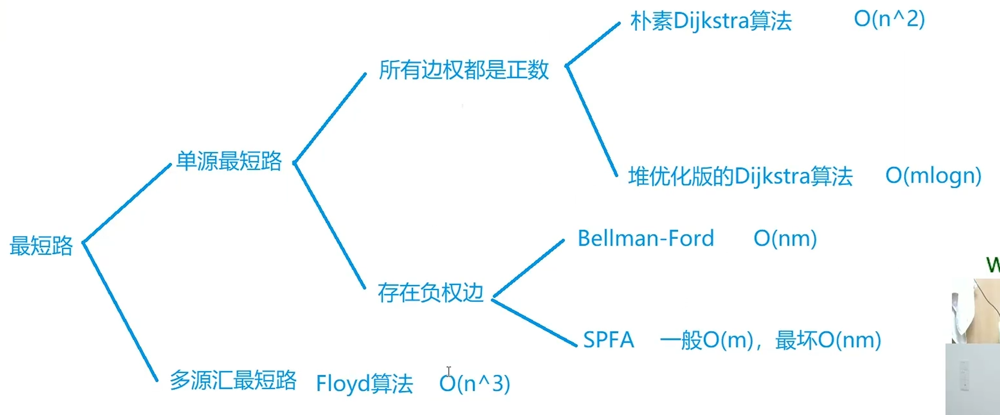

# 图

图的存储：

- 邻接矩阵
- 邻接表
- 链式前向星

## 最短路

非负权图 单源最短路 Dijkstra

Bellman-Ford

多源汇最短路 Floyd

## 二分图 Bipartite

https://leetcode.cn/problems/is-graph-bipartite/

## 拓扑排序

https://leetcode.cn/problems/course-schedule/

## 最小生成树 Minimum Spanning Tree

Kruskal

Prim
